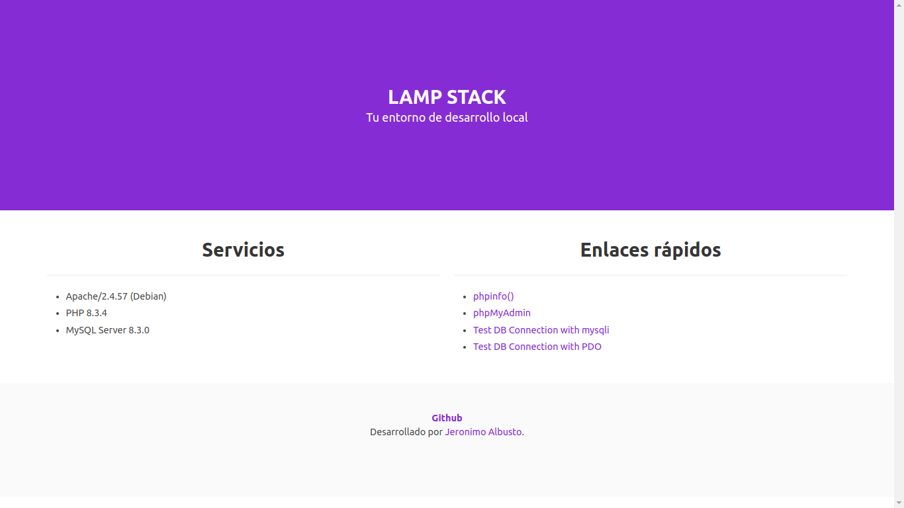

# LAMP STACK construido con Docker Compose



Un entorno de LAMP stack básico creado con Docker Compose. Consta de lo siguiente:

- PHP
- Apache
- MySQL
- phpMyAdmin
- Redis

A partir de ahora, tenemos varias versiones PHP diferentes. Utilice la versión de PHP adecuada según sea necesario:

- 5.4.x
- 5.6.x
- 7.1.x
- 7.2.x
- 7.3.x
- 7.4.x
- 8.0.x
- 8.1.x
- 8.2.x
- 8.3.x

## Instalacion

- clona este repositorio en tu compu
- configura el  .env
- ejecuta el comando `docker compose up -d`.

```bash
git clone 
cd docker-compose-lamp/
cp .env 
// modifica .env a tu gusto
docker compose up -d
// visita localhost
```
Tu LAMP  ya esta listo!! Puedes acceder por tu `http://localhost`.


Soy un apasionado y entusiasta desarrollador full-stack, me desempeño tanto en el
backend como en el frontend. Estoy habituada al trabajo bajo presión y en equipo, tengo
gran sentido de responsabilidad; así como alta vocación de servicio, capaz de generar valor
agregado a la organización mediante creación de ideas e iniciativa propia para la resolución
de problemas. Trabajo creando proyectos desde cero, usando tecnologías como docker para
desplegar y empaquetar mi app, mysql como base de datos relacional, node.js y su
framework express.js, para crear todo el backend, también creo api-rest y servicios para
consumir, los documento con Swagger. React.js como framework para el frontend y redux
para el manejo del estado, y todo el ecosistema de react.js, uso vite.js como generador 
proyectos, git para tener un control de mi código y de las versiones de mi desarrollos ,
también suelo usar next.js para desarrollar con react.js. Me gusta usar css puro, pero
también uso frameworks como tailwind, bootstrap, bulma y preprocesadores como sass.
Además he trabajado con otras tecnologías como php, con su framework Laravel, con
mongoDB como base de datos no relacional y postgres (relacional), con vue.js, vuex y nuxt,
con ORM como prisma, sequelize, con cookies, json web token, cors, etc.